class: center

```{r, fig.alt="The CDSB logo showing the superposed C & D letters in blue and red, with the spanish name Comunidad de Desarrolladores de Software en Bioinformática", echo=FALSE, out.width='100%'}
knitr::include_graphics("img/logo.png")
```

## Community of Developers for Software in Bioinformatics 

<br><br>

**Twitter:** [@CDSBMexico](https://twitter.com/CDSBMexico)

**Facebook:** [@CDSBMexico](https://www.facebook.com/CDSBMexico)

** Web page:** <https://comunidadbioinfo.github.io> 

---
class: chapter-slide

# Principle 1: The teaching cycle

---
# Invite external experts to train local community 

.pull-left[
<p align="justify">
Everything started with a question from professor Sandrine Dudoit during her visit at the Center of Genomic Sciences, UNAM.
</p>

<br>
### Who knows **R**?
```{r, fig.alt="The R logo",echo=FALSE,out.width='40%', fig.align='right'}
knitr::include_graphics("img/Rlogo.svg")
```
]

.pull-right[
.center[
```{r, fig.alt="The front photograph of professor Sandrine Dudoit",echo=FALSE,out.width='35%', fig.align='center'}
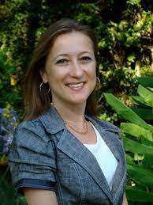
```
[Sandrine Dudoit](https://www.stat.berkeley.edu/users/sandrine/)  
One of the Bioconductor project founders

```{r, fig.alt="The logo of the Bachelor program of Genomic Sciences UNAM ",echo=FALSE,out.width='30%', fig.align='center'}
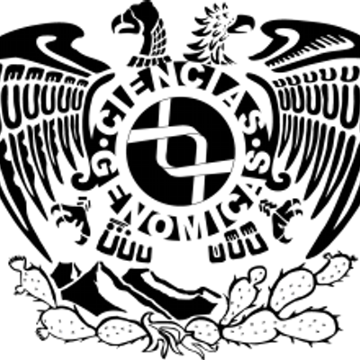
```
]
]
---
# Local members take the initiative to learn more

.pull-left[
.center[
**January 2008**

```{r, fig.alt="A map with an arrow from USA to Mexico showing the visit of James Bullard to our University.",echo=FALSE,out.width='80%', fig.align='center'}
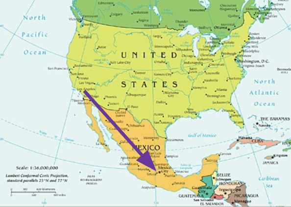
```

```{r, fig.alt="The front photograph of professor James Bullard",echo=FALSE,out.width='32%', fig.align='center'}
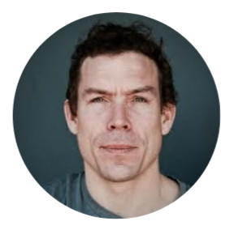
```
James Bullard
]
]

.pull-right[
.center[
**Summer 2008**

```{r, fig.alt="A map with an arrow from Mexico to USA showing the attendance of two CDSB members to their first R/Bioconductor conference.",echo=FALSE,out.width='80%', fig.align='center'}
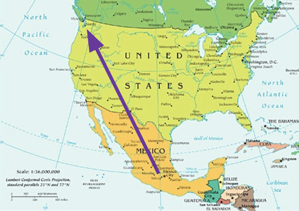
```

```{r, fig.alt="The front photograph of professor James Bullard",echo=FALSE,out.width='65%', fig.align='center'}
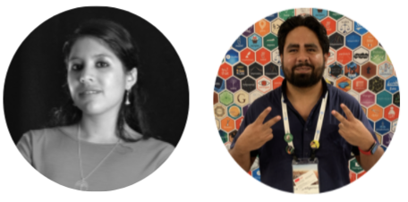
```
[Alejandra Medina-Rivera](https://twitter.com/AleMedinaRivera) and [Leonardo Collado-Torres](https://twitter.com/lcolladotor)
]
]

---
# Local members teach others 

<br><br><br>
Leonardo became a co-instructor at his undergraduate program.

```{r, fig.alt="The announcement of Leonardo's first workshop saying:  R/Bioconductor workshop Oct-Nov 2008. This workshop was meant as a short course and was part of the Bioinformatics and Statistics subject directed to the fifth semester students of the Program of Genomic Sciences.",echo=FALSE,out.width='90%', fig.align='center'}
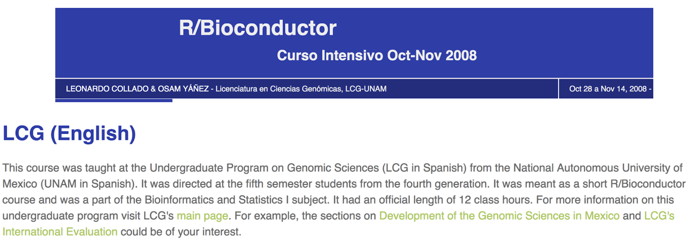
```

---
# Repeat the teaching cycle

<br>
.left-column[<br>
```{r, fig.alt="An arrow that connects the last step of the teaching cicle with the first one.",echo=FALSE,out.width='80%', fig.align='center'}
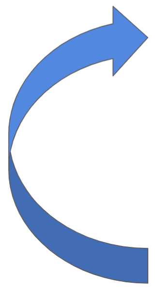
```
]

.right-column[<br>
- ** A external expert trains local community.**
<br><br><br>
- ** Local members take the initiative to learn more. **
<br><br><br>
- ** Local members take the lead to train new community members. **
<br><br><br><br>
]

--
## Everything seemed to work but...

---
# We faced some issues

<br><br>
- ** Trained members moved away following their careers (The cycle was difficult to maintain). ** <br><br><br>
- ** Communities work with voluntaries (we needed more of them). ** <br><br><br>
- ** New members were not taking opportunities due to language barriers. ** <br><br><br>

---
class: chapter-slide

# Principle 2: Provide continous support

---
# We work as a virtual academic department

.pull-left[
.center[
```{r, fig.alt="The Slack logo.",echo=FALSE,out.width='50%', fig.align='center'}
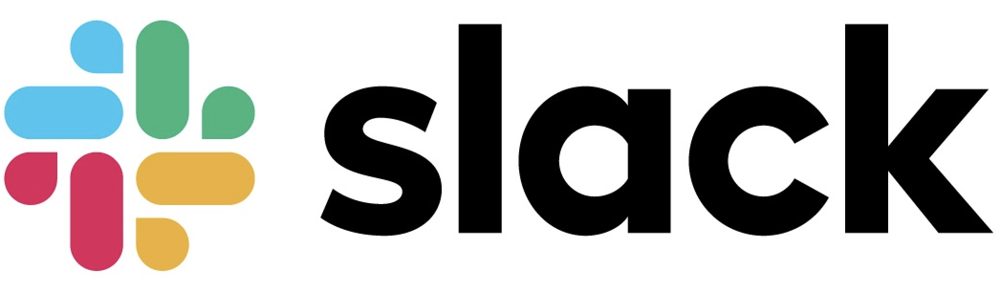
```
Join us [here](https://join.slack.com/t/comunidadbioinfo/shared_invite/zt-8lsvpm84-Fne1W0hadk6cpjgJS17Tnw)

```{r, fig.alt="A CDSB Slack announcement about the open registration for useR! 2021.",echo=FALSE,out.width='100%'}
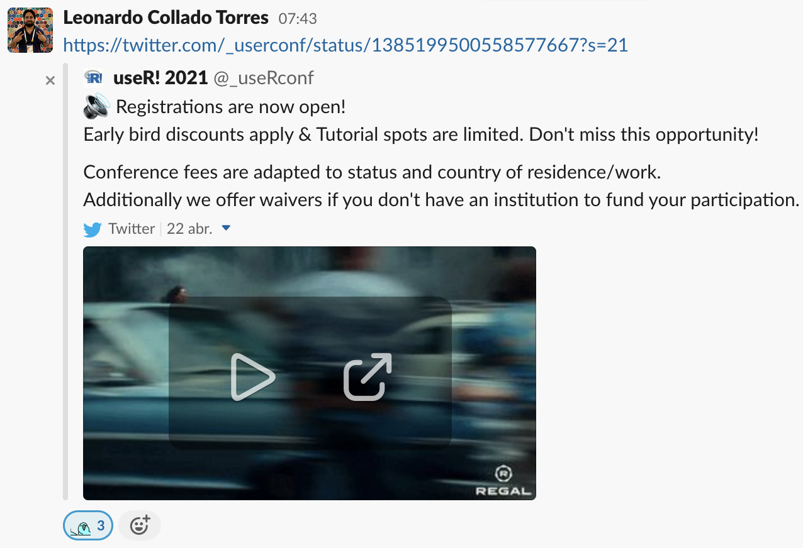
```
]
]

.pull-right[
- Diverse topic members.
- Announcements about local and international events.
- Advice and feedback for scholarship applications.
- Code/Programming advice.
- Full-year feedback about CDSB workshop's content.
- Promote ideas exchange and collaborations.
- Highlight member's work and contributions.
<br>

### 235 CDSB members!
]

---
# Some results

## Participation in conferences

.pull-left[
<p align="justify">
Three members obtained a developer scholarship and presented their contributions at Bioconductor Conference 2019 (New York City, USA).
</p>

```{r, fig.alt="Ana Beatriz Villaseñor presenting her work at the Rockefeller University auditorium.",echo=FALSE,out.width='94%', fig.align='center'}
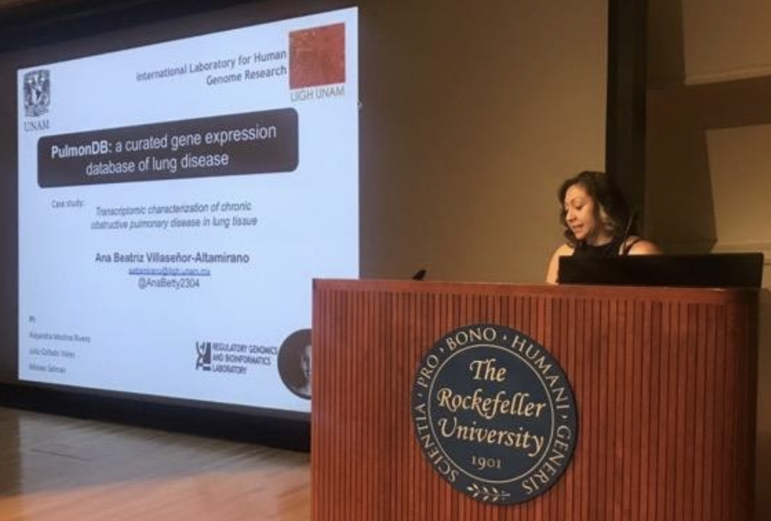
```
.pull-right[
@AnaBetty2304
]
]

.pull-right[<br><br>
```{r, fig.alt="Leonardo, Alejandro and Pedro at the Rockefeller University garden practicing the speech of Joselyn's presentation.",echo=FALSE,out.width='100%'}
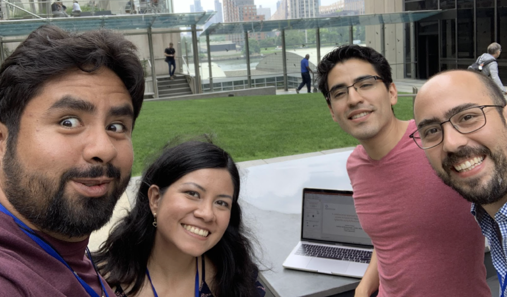
```
CDSB support during the conference, practicing @josschavezf1 speech with @lcolladotor, @areyes, @doctor_calvo.
]

---
## Participation in conferences

.pull-left[
<p align="justify">
One member obtained a diversity scholarship to attend RStudio Conference 2020 (San Francisco, USA).
</p>
```{r, fig.alt="Joselyn stands besides the congratulation's baloons for the diversity scholarship recipents of RStudioConf 2020.",echo=FALSE,out.width='100%'}
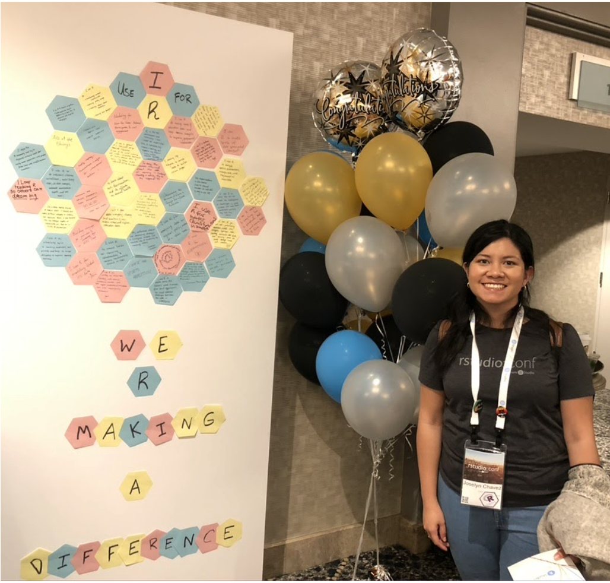
```
<br><br>
.pull-right[@josschavezf1]
]

.pull-right[
<p align="justify">
One member obtained a diversity scholarship to attend useR! Conference 2020 (Virtual format).
</p>
```{r, fig.alt="Twitter from Ana Beatriz thanking useR! 2020 for her diversity scholarship.",echo=FALSE,out.width='95%', fig.align='center'}
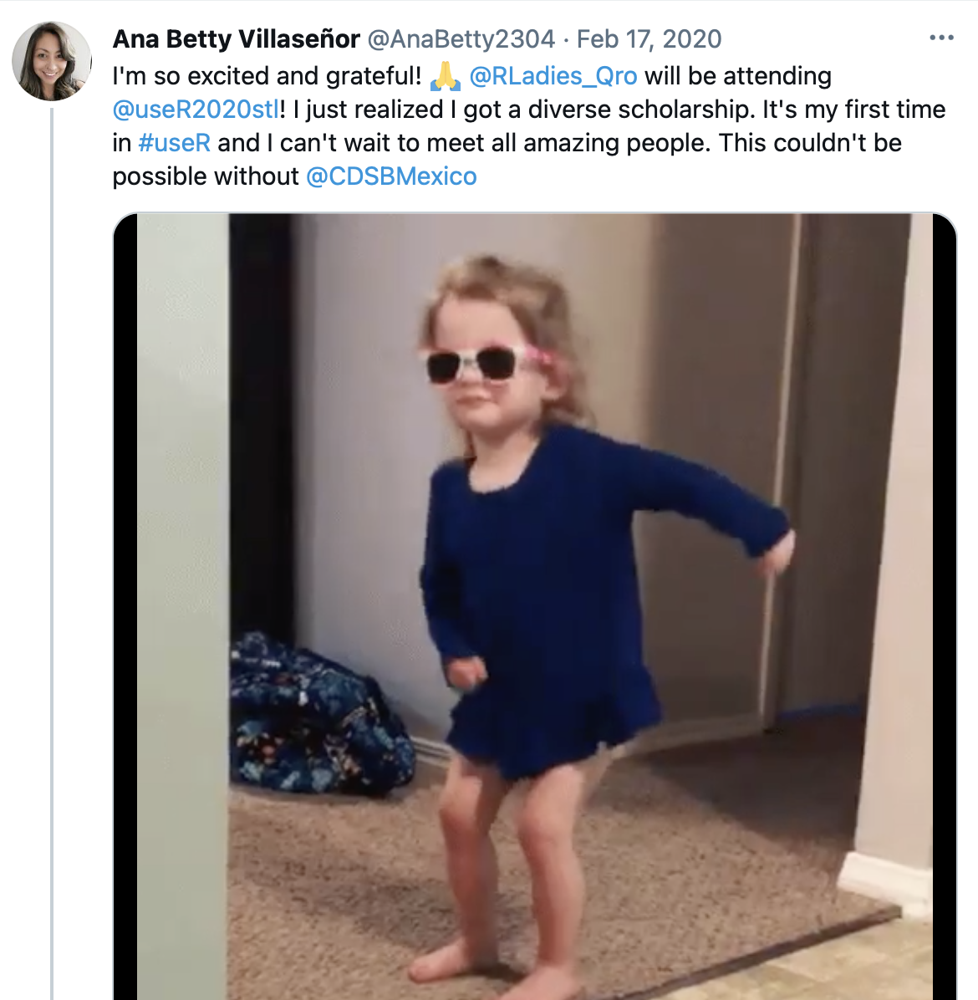
```
<br><br>
.pull-right[@AnaBetty2304]
]

---
## Participation in conferences

12 CDSB members attended Bioconductor Conference 2020 (Virtual format).
<br><Br>
3 of them presented their contributions (Poster).

```{r, fig.alt="Faces of twelve CDSB members that attended Bioconductor conference in 2020.",echo=FALSE,out.width='70%', fig.align='center'}
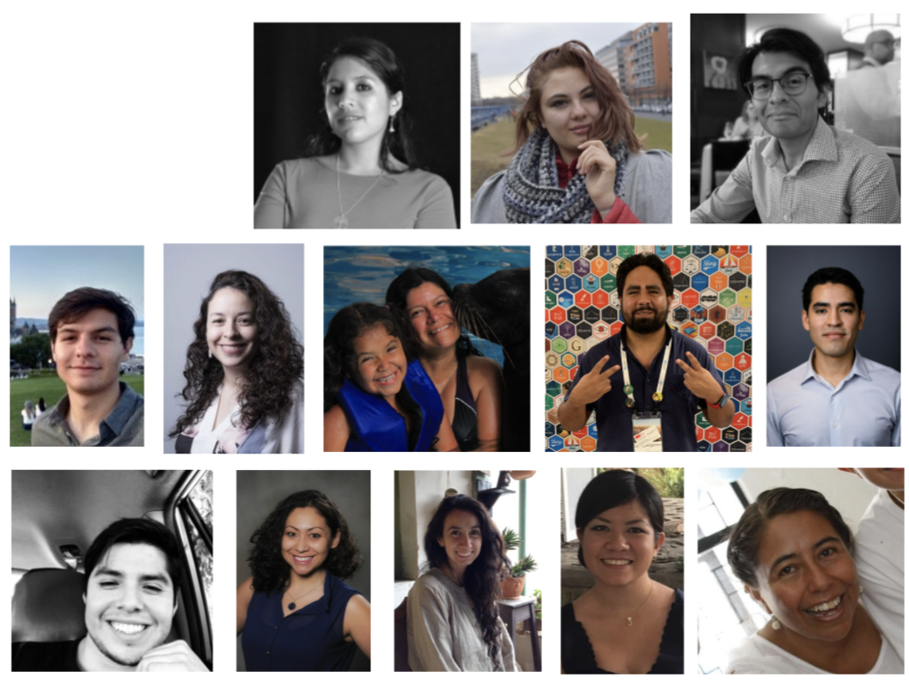
```

---
## Participation in conferences
<br>
Diverse conference talks introducing the CDSB community.
<br><br><br>
.pull-left[
.center[**JSM 2020**]

```{r, fig.alt="JSM 2020 title-slide with the CDSB logo and the text: Promoting the next wave of R/Bioconductor developers in Latin America starting in Mexico.",echo=FALSE,out.width='100%'}
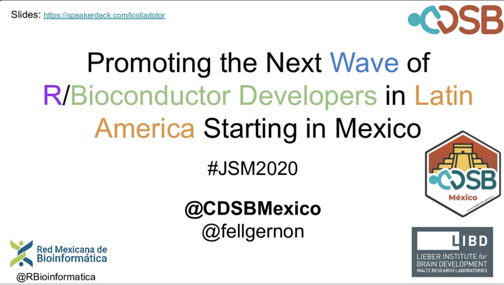
```
]

.pull-right[
.center[**ConectaR 2020**]

```{r, fig.alt="ConectaR 2020 title-slide with the CDSB logo, the ConectaR logo and the full name Community of Developers of Software in Bioinformatics.",echo=FALSE,out.width='100%'}
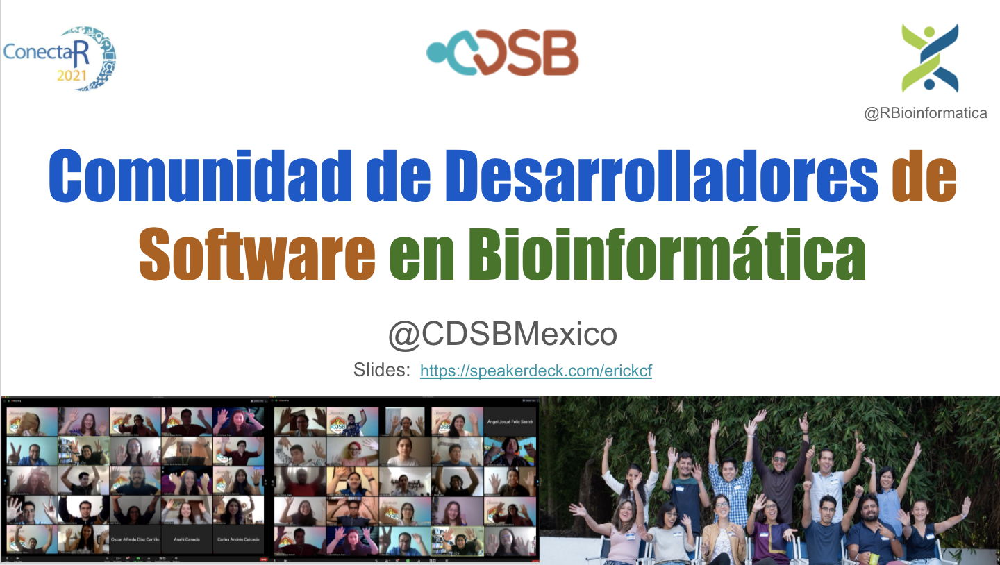
```
]

---
## Collaborative projects

<br>

regutools is the first Bioconductor package fully written by CDSB members.

<br>

.pull-left[<br>
```{r, fig.alt="The Bioconductor page of regutools, showing the text 'regutools: an R package for data extraction from RegulonDB.' ",echo=FALSE,out.width='100%'}
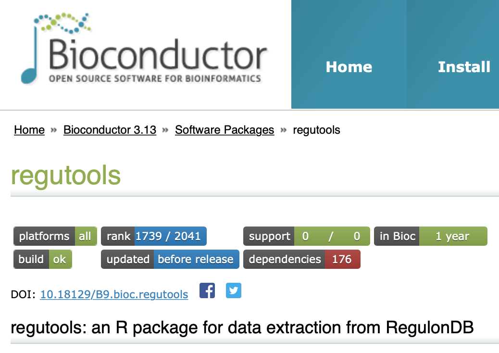
```
]

.pull-right[
```{r, fig.alt="The front page of regutools article published in the journal  Bioinformatics with the title Programmatic access to bacterial regulatory networks with regutools.",echo=FALSE,out.width='100%'}
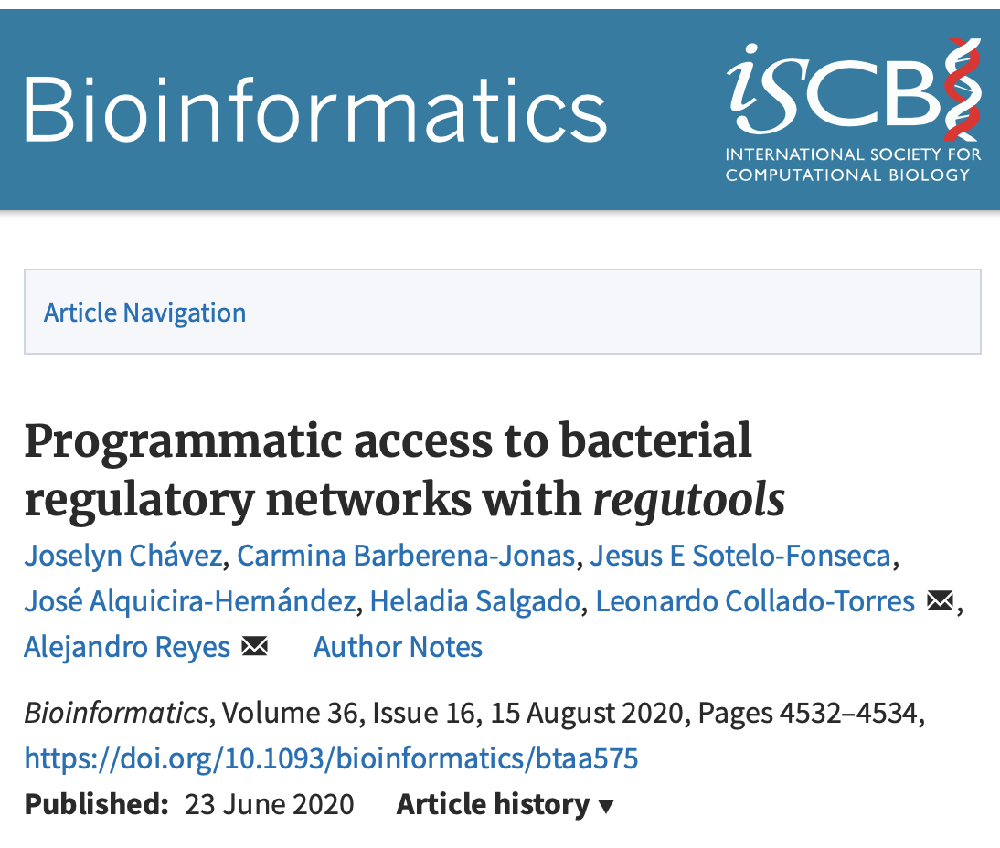
```
]

---
class: chapter-slide

# Principle 3: Invite enthusiastic members to join the board team

---
# Students became board members and instructors

Joselyn joined the team after the annual CDSB workshop in 2019.

She was one of the instructors for 2020, teaching materials from the course she took during RStudioConf.

```{r, fig.alt="ConectaR 2020 title-slide with the CDSB logo, the ConectaR logo and the full name Community of Developers of Software in Bioinformatics.",echo=FALSE,out.width='90%', fig.align='center'}
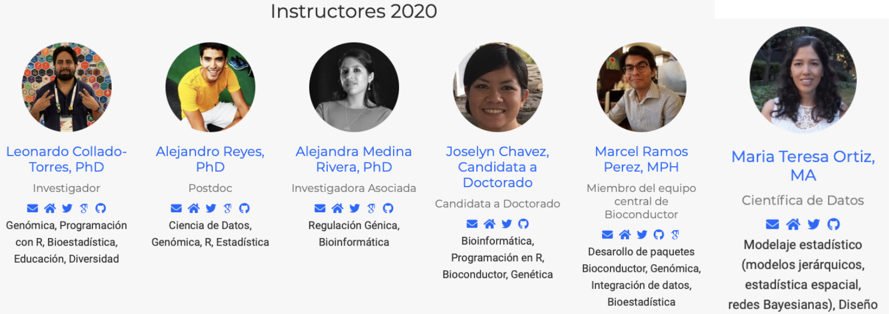
```

---
# Students became board members and instructors

.pull-left[
Erick joined the team after the annual CDSB workshop in 2020. He will be an instructor this year.

```{r, fig.alt="The CDSB board team faces updated in 2020, now including Erick.",echo=FALSE,out.width='100%', fig.align='center'}
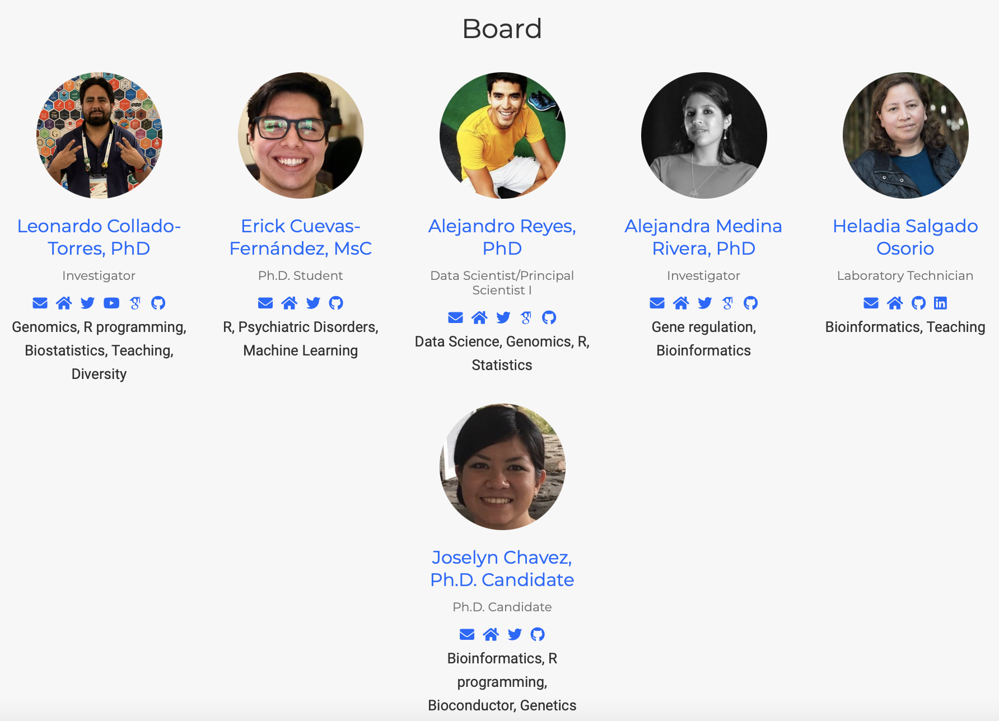
```
]

.pull-right[
Erick and Joselyn lead our monthly short courses in collaboration with RMB.

```{r, fig.alt="Poster of the first mini course organized and chaired by Erick and Joselyn with the title in Spanish: Introduction to R and RStudio.",echo=FALSE,out.width='90%', fig.align='left'}
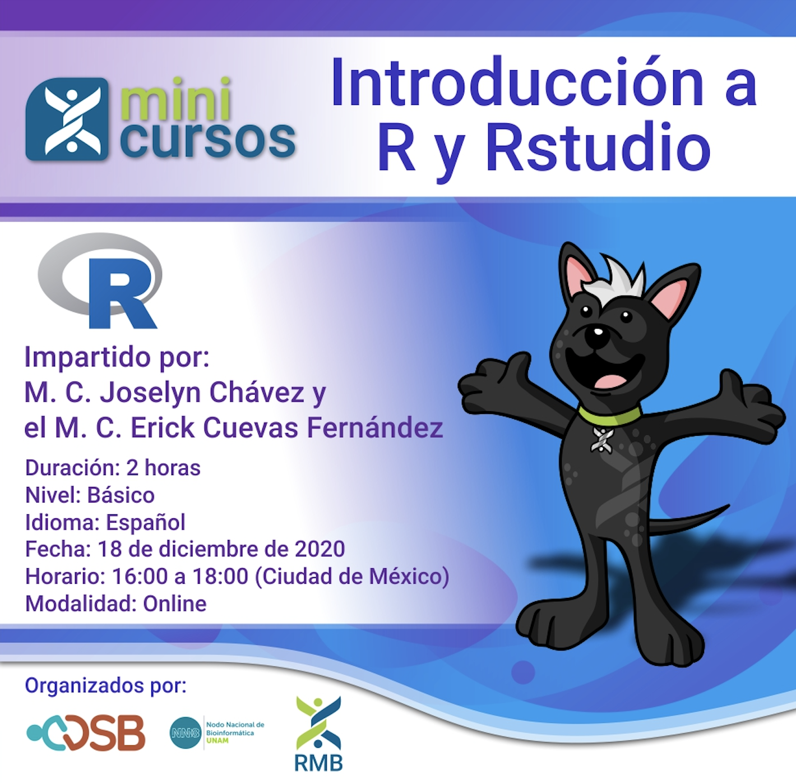
```
]

---
class: chapter-slide

# Principle 4: Network with other communities

---
# We are not alone
<br>
.pull-left[
[
```{r, fig.alt="Logo of the Mexican Network of Bioinformatics, showing a blue and green double-DNA strand with the Spanish name in blue", echo=FALSE,out.width='90%', fig.align='center'}
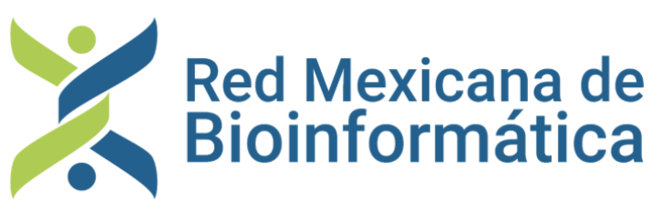
```
](https://www.redmexicanadebioinformatica.org)
<br><br><br><br><br>
[
```{r, fig.alt="Logo of the Center of Genomic Sciences, showing a blue and black circle with the Spanish name in black.",echo=FALSE,out.width='80%', fig.align='center'}
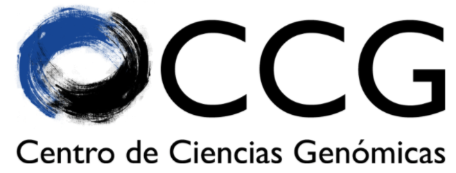
```
](https://www.ccg.unam.mx)
]

.pull-right[
[
```{r, fig.alt="Logo of the National Node of Bioinformatics, showing a green circle with the Spanish name in green.",echo=FALSE,out.width='90%', fig.align='center'}
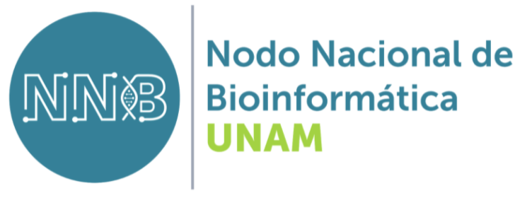
```
](http://www.nnb.unam.mx)

[
```{r, fig.alt="Logo of R-Ladies Mexico, showing the original R-Ladies logo inside a hexagon with the green, white and red colors of the Mexican flag.",echo=FALSE,out.width='65%', fig.align='center'}
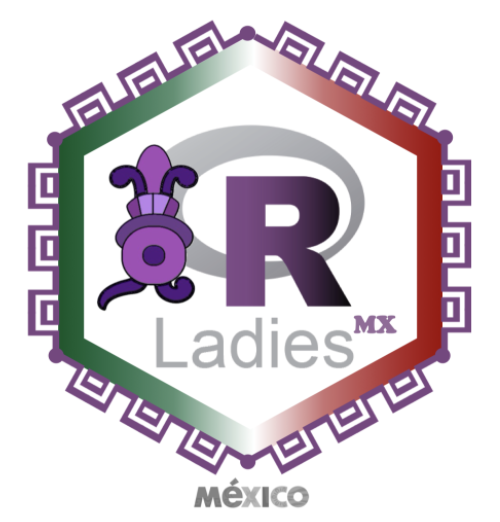
```
](https://rladiesmx.netlify.app)


]
---
class: chapter-slide

# Principle 5: Look for sponsors

---
# Your support is invaluable

.pull-left[<br><br><br><br><br>
Thanks to our sponsors we are able to:

- Provide scholarships.
- Invite international instructors.
- Support local instructors.
- Support TA's.
- Improve technical facilities.
- Maintain an administrative team.
]

.pull-right[
```{r, fig.alt="Logo of R-Ladies Mexico, showing the original R-Ladies logo inside a hexagon with the green, white and red colors of the Mexican flag.",echo=FALSE,out.width='100%', fig.align='center'}
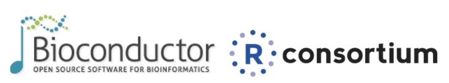
```

```{r, fig.alt="Logo of R-Ladies Mexico, showing the original R-Ladies logo inside a hexagon with the green, white and red colors of the Mexican flag.",echo=FALSE,out.width='100%', fig.align='center'}
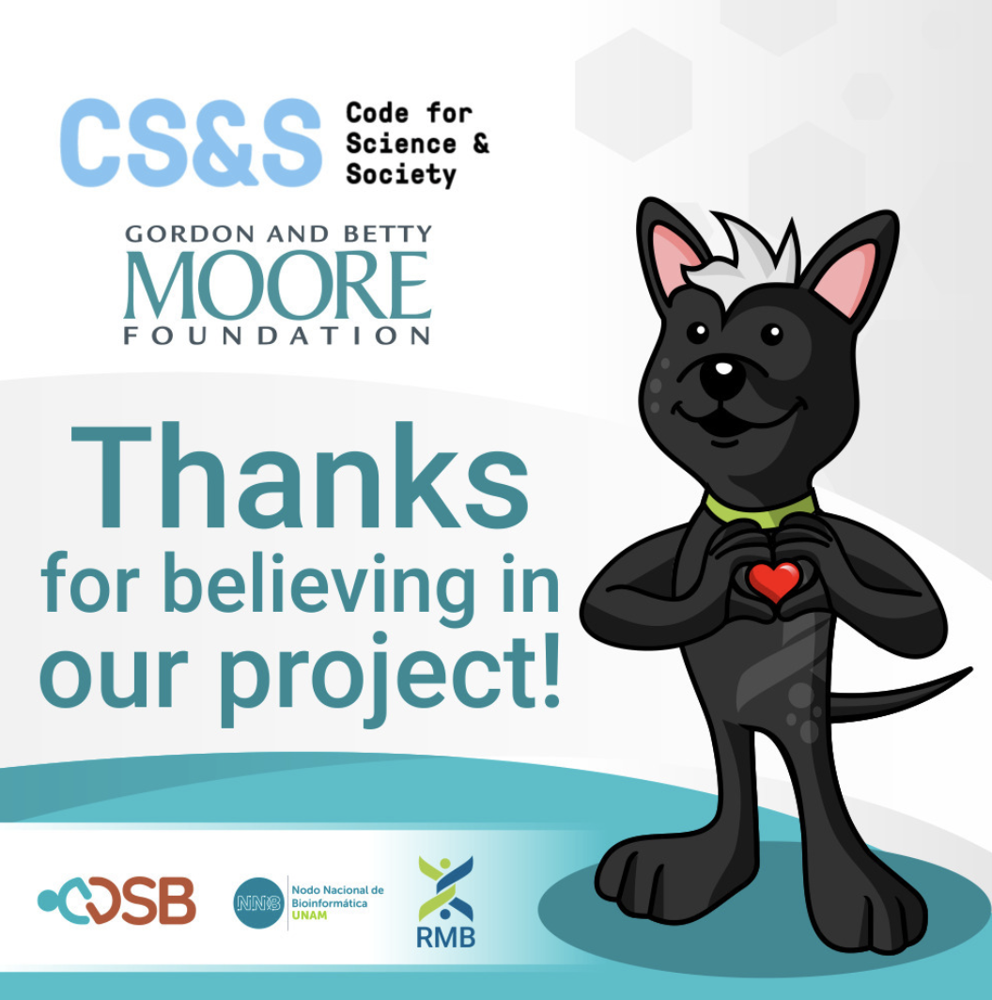
```
]

---
class: chapter-slide

# It's your turn!

---
# Let's grow up your community

Go to our collaborative document and write some ideas about how this principles apply to your community.

Viewer mode:
<https://hackmd.io/@josschavezf/incubator_useR2021/>

Edit mode: 
<https://hackmd.io/@josschavezf/incubator_useR2021/edit>

```{r, fig.alt="The useR maRmot drawing on a tablet.", echo=FALSE,out.width='40%', fig.align='right'}
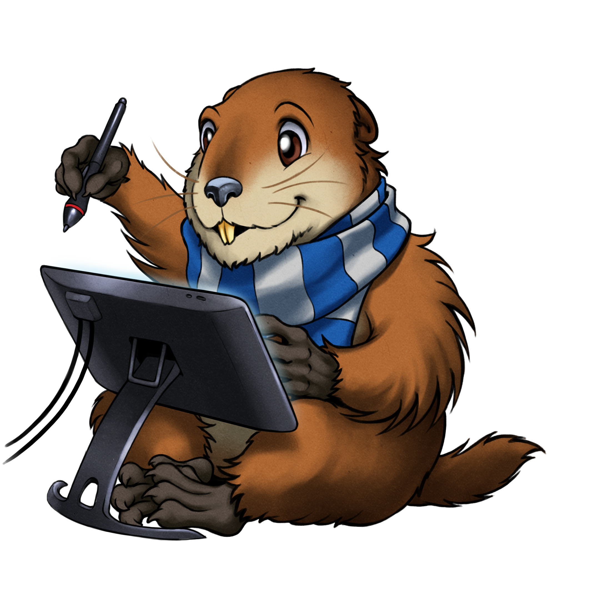
```

---
class: middle, center

```{r, fig.alt="The CDSB logo with the Spanish full name.", echo=FALSE,out.width='100%'}
knitr::include_graphics("img/logo.png")
```

<br>

# Thanks for your attention!

```{r, fig.alt="The useR maRmot waving.",echo=FALSE,out.width='40%', fig.align='right'}
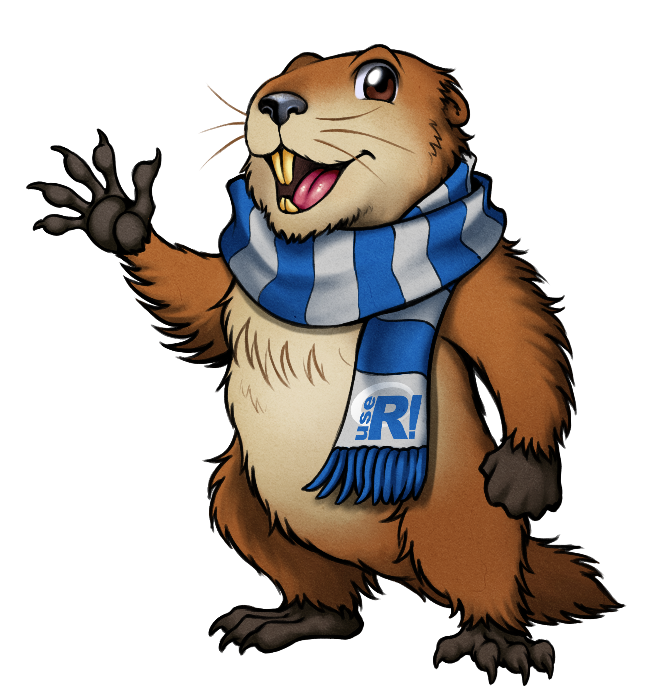
```
